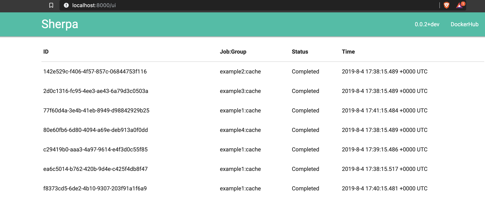

# Sherpa UI

The Sherpa UI provides an easy visualise overview of scaling activates which have taken place. It is namespaced under /ui, but visiting the root of the Sherpa server in your browser will redirect you to the Web UI.

